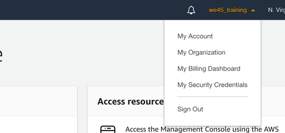
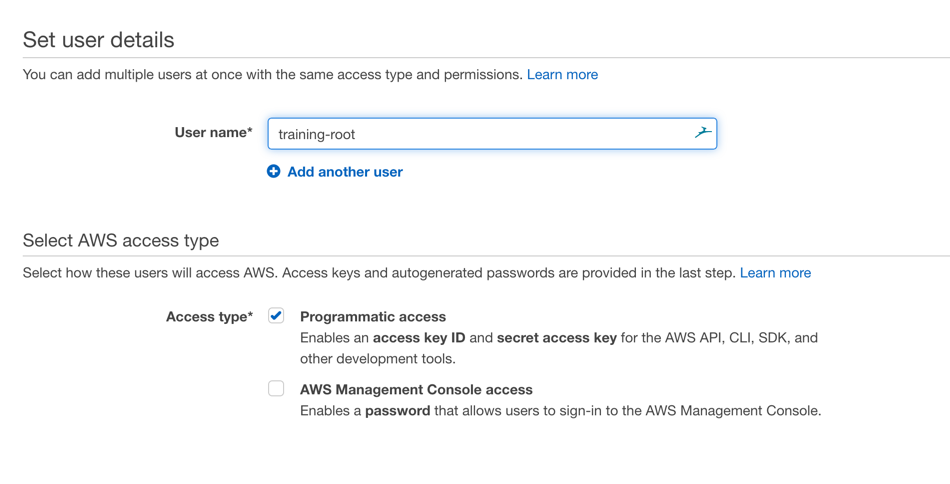
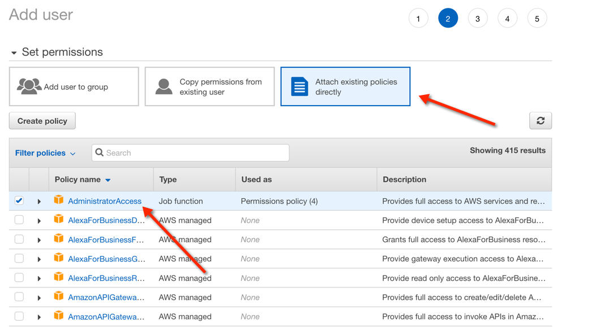

## Configuring AWS-Command Line Interface (CLI)
>Using AWS CLI we can control multiple AWS Services from 
the command line.


### Pre-Processing Setup - Add an Admin User

* With a browser on your host machine, navigate to `https://signin.aws.amazon.com/signin`
* Login to your AWS Account with your username and password
* In the top right corner, where you have the user's name or account info, click on the dropdown and select `My Security Credentials`

    

* Now, from the sidebar, go to the `Users` menu

    

* Now, click on `Add User` to add a new admin user

    

* Give a name to your user, like below and select `Programmatic Access`

    

* Directly attach policy and select `AdministratorAccess` from the list of Policies. You might have to search for this policy

    
    
* Click through till you hit the `Create User` screen, where you should click on `Create User`

	
	
* Now, you should see a screen with a AWS Access Key ID and Secret + csv download option. You can either, copy both values and use it in Step 3, else you can download the csv file, and use the values in there to copy in Step 3

	
	

### Setup AWS CLI

##### Step 1:

* Open Terminal

	

##### Step 2:

*  **cd** into  `/home/vagrant/Desktop/Labs/AWS-Security-Training/cli`

    ```commandline
    cd  /home/vagrant/Desktop/Labs/AWS-Security-Training/cli
    ```


##### Step 3 :

We should provide our **AWS Access Key**, **AWS Secret KEY** and **Region** to configure AWS CLI

* Run `aws configure`

```commandline
root@ubuntu:~/Desktop/Labs/AWS-Security-Training/cli# aws configure
AWS Access Key ID [****************AFLQ]: 
AWS Secret Access Key [****************V4LV]: 
Default region name [us-east-1]: 
Default output format [json]: 
```

This command is interactive and prompts you to enter additional information. Enter your Access Key ID, Secret Access Key, Region Name and skip the Output Format using the ENTER Key allowing it to take the default value.


**Note:**  AWS CLI is now ready to use.
