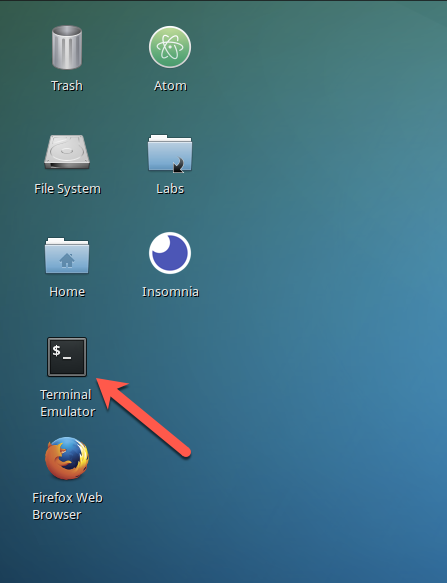

## Terraform Basic Commands

>Terraform is controlled via a very easy to use command-line interface (CLI). Terraform is only a single command-line application: terraform. This application then takes a subcommand such as "apply" or "plan". 


##### Step 1:

* Open Terminal




##### Step 2:

* Run `terraform`

```commandline

root@ubuntu:~/Desktop/Labs# terraform
Usage: terraform [-version] [-help] <command> [args]

The available commands for execution are listed below.
The most common, useful commands are shown first, followed by
less common or more advanced commands. If you're just getting
started with Terraform, stick with the common commands. For the
other commands, please read the help and docs before usage.

Common commands:
    apply              Builds or changes infrastructure
    console            Interactive console for Terraform interpolations
    destroy            Destroy Terraform-managed infrastructure
    env                Workspace management
    fmt                Rewrites config files to canonical format
    get                Download and install modules for the configuration
    graph              Create a visual graph of Terraform resources
    import             Import existing infrastructure into Terraform
    init               Initialize a Terraform working directory
    output             Read an output from a state file
    plan               Generate and show an execution plan
    providers          Prints a tree of the providers used in the configuration
    push               Upload this Terraform module to Atlas to run
    refresh            Update local state file against real resources
    show               Inspect Terraform state or plan
    taint              Manually mark a resource for recreation
    untaint            Manually unmark a resource as tainted
    validate           Validates the Terraform files
    version            Prints the Terraform version
    workspace          Workspace management

All other commands:
    debug              Debug output management (experimental)
    force-unlock       Manually unlock the terraform state
    state              Advanced state management

```

### terraform init
    
    Initialize a new or existing Terraform configuration
    
### terraform apply

    Builds or changes infrastructure
    
### terraform destroy

    Destroy Terraform-managed infrastructure
